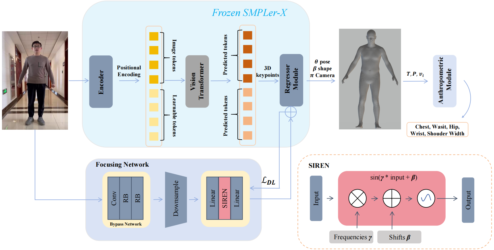

# CVPR25: A Focused Human Body Model forAccurate Anthropometric Measurements Extraction

* A summary paper will be published in the **[proceedings of the IEEE/CVF Computer Vision and Pattern Recognition Conference (CVPR) 2025](https://cvpr.thecvf.com/)**

## Pipeline


Our human body model is based on a frozen [SMPLer-X](https://github.com/caizhongang/SMPLer-X), while a trainable Focusing Network constrains the backbone focusing on the measurement parts. Reconstruction results are constantly refined by dynamic loss. The anthropometric module outputs final body measurements which are calculated based on the ISO 8559 standard.




## Usage

### 1. Setup the Environment

  ```
  pip install -r requirements.txt
  ```

### 2. Reconstruct the SMPLX model
```
  cd main
  python inference.py --num_gpus 1 --exp_name output/test --pretrained_model ${CKPT} --img_path ${IMG_PATH} --start 1 --end
  ```


## Acknowledgement
This repo is modified and adapted on these great repositories, we thank these authors a lot for their great efforts.
- [SMPLer-X](https://github.com/caizhongang/SMPLer-X)
- [Hand4Whole](https://github.com/mks0601/Hand4Whole_RELEASE)
- [OSX](https://github.com/IDEA-Research/OSX)
- [MMHuman3D](https://github.com/open-mmlab/mmhuman3d)
